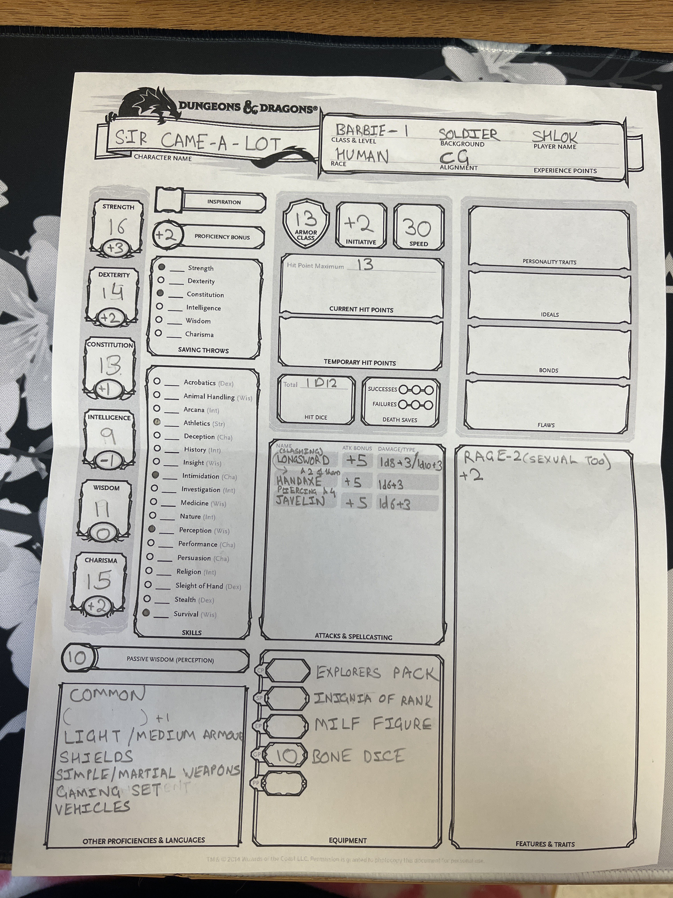

- Timeline
  collapsed:: true
	- 0 - The world is born
- World
  collapsed:: true
	- Albidaya
	  collapsed:: true
		- We start on an island called Albidaya, which in recent years has fallen into somewhat of a disarray. A tyrannical king and his corrupt army have caused rifts between the four factions that control the island. The island is split into 4 main areas, with the royal city almost being a bubble in the center. Each of these areas are controlled by a faction (controlled is loose and many that live in each part are not necessarily part of the faction but just reside there) and the royal family sits at the top as monarchs. The factions (and the features of the areas they control are as follows:
		- Order of the gauntlet (top left section of the island) - These are people that aim to do good and purify the land of evil, but many of their ranks have fallen to corruption due to the king's influence. However some still remain strong in their ideals trying to help as many people as possible. The area is characterized by small towns and villages with some farmland and a focus on fishing due to the ocean and a river passing through. However there are no ports leaving the island in this section.
		- Emerald Enclave (bottom left section of the island) - These are people who oppose threats to the wilderness and aim to survive in the wild. In recent years, the kingdom has grown oppressive to their self sufficiency, and wants them to provide for the kingdom rather than just for themselves. Generally, they remain safe from the kingdom because their forces are so spread out. This area is characterized by a large forest and large camps spread over the trees and hills. The emerald enclave has no need to leave the island, so there are no ports in this section.
		- Zhentarim (bottom right section of the island) - This is the section with a large city and bustling crowds as well as where many of the poor and struggling live. It is mainly controlled by the kingdom and aims to keep the poor, poor. In recent years, all the ports around the island including 2 located in Zhentarim were closed by the kingdom to ensure people didn’t leave en mass. The largest port town known as Innsmouth was not closed by the kingdom, but suddenly surrounded by fog and the residents began to act oddly, so it was abandoned.
		- Blood Hunters (top right section of the island) - This area is named Khoon, and the people are characterized as hard workers who physically work their body and build it to survive the harshest of conditions. The land is split by two snowy mountain ranges forming a cross, and these people have learned to adapt this harsh environment. However, due to this harshness, not many people come and go, and only a small group of elite warriors actually thrive in this environment. There are small camps of these people in the valleys of these ranges, and most commoners live in small villages in the areas in between (usually closer to the center).
		- You guys can choose a faction and actually be part of it, or just simply have lived in one the areas before. Can also live in the main royal city in the middle, but remember that the king and his connections are evil and came into power around 10 or so years ago.
	- Kisarra - Desert island, but not much is known about it. Many choose to avoid it because of harsh conditions and oppressive border control. The main area of the island is surrounded by a wall.
	- Rìběn - A beautiful archipelago with mountains and natural beauty
	  collapsed:: true
		- Theocracy - Head Priest and 12 main priests
			- They worship [Ilmater](https://forgottenrealms.fandom.com/wiki/Ilmater) diety of endurance, martyrdom, perseverance, and suffering.
	- Yalti - Another beautiful island with well made architecture, with mountains dividing its sects. However, a large crime ring has taken over much of the island.
	- Girar - A supposedly perpetually spinning island, creating a whirpool-like surrounding, making it hard to enter. Not many have explored this island and the reason for its spinning is unknown.
	- Uzumaki - A large melting pot of races and cultures throughout the large spiral with tropical and rainforest environments throughout.
	- Mysterious area covered in magical clouds.
- Planning
  collapsed:: true
	- DM Notes
	  collapsed:: true
		- Random shit
		  collapsed:: true
			- Horseshoes of a zephyr allows you to have ocean-based cavalry. You can literally be pirate mongolian horse archers. Water walk also works but since it's impermanent it works best for short mounted attacks and raids, or for a surprise bording.
		- Timeline of Villain
		  collapsed:: true
			- 
			-
		- Map
		  collapsed:: true
			- _1727239651903_0.jpg)
			- 
			-
		- Ancient Language
		  collapsed:: true
			- 
			-
		- General Knowledge
		  collapsed:: true
			- 4 ancient heroes
			  collapsed:: true
				- gith
				- dwarf - king
				- goliath
				- drow
			- Hitora - [https://www.dndbeyond.com/monsters/2506152-eldritch-lich](https://www.dndbeyond.com/monsters/2506152-eldritch-lich)
			- Beverly - [Death Knight](https://www.aidedd.org/dnd/monstres.php?vo=death-knight)
			- Saigai - Calamity disguised
			- Pantheon
				- Eldath
				- [Ilmater](https://forgottenrealms.fandom.com/wiki/Ilmater)
				-
			- Magical Items
				- Owned
					- Shadowfell crystal
					- Eldath Longbow - Eldath offered an oath for Jichael (multiclass)
					- Plane travel cube
				- Not owned
			- 1.5 days till plan
			- Shadowfell
				- Portals
				- Revenants - Jesus??
				- Dragon behind the mountain
				- Lucy Stitchsole
	- Session 1
	  collapsed:: true
		- A lost Willow comes upon a small band of strugglers amidst a storm
		- As they all search for shelter in the storm, they see a light in the distance and the sounds of warm welcome
		- As they get closer, they see it is a tavern: The Lonely Pig
			- NPCs:
				- Gimli - Gruff dwarf bartender
				- Various rowdy drunkards
				- Many who wanted to escape the storm as well
				- A group of four Kenku who are huddled in the corner
			- After the group gets to know each other and the storm dies down, people have cleared out other than a few drunks and the kenku, the kenku start to move. One goes to gimli, but starts moving to go behind the counter (roll a DC 10 perception check). 2 move to the party and 1 stands by the bar waiting for something
			- 1 pulls out his shortsword and stabs it into the table and says leave now and nobody gets hurt, though the voice doesn't seem to match him and is in weird cadences.
		- After that encounter, if Gimli survives, he offers to let them sleep there and keep whatever treasure they found as thanks
		- When they leave in the morning, they can get to know each other and decide where to go
		- 
		- Summary
			- Traveling through a treacherous storm after leaving his hometown in the Wild Tiger Wilds based in the Emerald Enclave, Willow stumbles upon a band of travelers in the poor sector called Zhentarim. Among these travelers, Willow befriends Zunitra, the bard of the travelers. Zunitra and his band are from the town of Innsmouth, but they can’t seem to remember many details of their past, and fled from Innsmouth when a mysterious fog descended on the town. These two attempt to wait out the storm in a tavern, where the rest of the crew slowly becomes acquainted.  Having become acquainted, they notice a suspicious group of bird people, who they later found were kenkus. After many of the patrons left, the kenkus attempt to rob the tavern, and are killed by the party, except for one who was tortured and killed by Willow. The owner offers them the money and housing for the night which they took not so graciously.
			- Party met in tavern
			- Fought Kenkus
			- Got Treasure
			- Rested
	- Session 2
	  collapsed:: true
		- Summary
			- Leaving the tavern, the group decides to travel up in to the sector of Khoon, a harsh mountainous region inhabited by the few who could and choose to survive here. With a few encounters with locals and a small fight with kobolds, they find that something has been rumbling in the mountain in the intersection of the ranges recently. The group decided to travel to this mountain, climb it, and find it to be a volcano type shape, where there is a hole in the top, but to their surprise it is decently shallow and reaches about 15-20 feet down. After some investigation, they find a secret panel that opens to stairs deeper into the mountain. One floor down, they found a treasure chest, which turned out to be a mimic. They fight and kill the mimic and find that the room has a stone elevator leading deeper into the mountain. As they go down further, they find this floor is the inside of a large tree inside the mountain. The elevator comes down into a storage room where they meet ~~two~~ one girl who is timid, but eventually warms up to the group and shows them around the tree home. The girl also mentions her mom, who has been gone for a while, and points out Boof, a suspicious looking blue cat-type humanoid in a cage. The mom seems to be an oppressive figure, not really a mother but more of a slave master and evil witch. The party rests, but hear the elevator begin to rumble.
			- Traveled to Khoon
			- Went to mountain
			- Fought mimic
			- Met girl
			- Found out about mom
			- Met Boof
			- Elevator rumbles
	- Session 3
	  collapsed:: true
		- Summary
			- Getting ready for a battle, the party hides except Came-a-lot, who is talking to Boof. The mother, a green hag, notices intruders in her lair, and goes invincible. Before this, she drops her prisoner who turns out to be Saturn. She slashes through his body with her claws from behind and a fight ensues. After a long arduous fight, the hag is killed with a arrow through the head from Jichael. Before her death, she curses Boof, giving him immortality but reducing his physical effectiveness to 0. After the fight, the party collects loot finding jars with green liquid, health potions, and a talking shrunken head who the party names Alexa. After some testing, they find the green liquid gives the party vine like powers, but has symptoms after consumption (they know it deals damage, but not how much since Boof has 1 hp). The girl tells them of the rumbling underneath and the party finds that destroying the floor leads to a pathway to further underneath the mountain. After climbing down, they find a gargantuan dragon encased in glowing ice named Gythrem. The dragon speaks, but his mouth doesn’t move. After a bit of conversation, the party finds out about a party before them that encased him in the ice around 300 years ago. He lived on this mountain when he saw them and then blacked out and next thing he knew he was trapped here. He describes the party as a green skinned man with spikes, a drow much like Jichael, a dwarf that looks suspiciously like the tyrannical king of Albidaya, and a tall burly goliath. Some of the party recognizes this group as the heroes of old only spoken about in legends. The party leaves armed with this information and promises to come back for the dragon. The group rests in the lair, and as the clock turns 12, the girl transforms into a hag, but dispels the evil from her because of her pure heart. After some investigation, the party finds that there are 4 other hags left on the island  that this green hag knows of. 3 sea hags, a mysterious fourth that she doesn’t know much about. After their rest, the group leaves for Innsmouth, aiming to leave the island.
			- Meet Saturn as Hag comes down
			- Fight and kill Green Hag
			- Boof is cursed
			- Get green potions and Alexa
			- Meet Gargantuan White Dragon - Gythrem
			- Learned about heroes of old - green skin, drow, dwarf (looks like king of Albidaya), goliath
			- Promised Gythrem they would return
			- Girl transforms into good hag
			- 4 other hags on island, 3 sea, 1 unknown
			- Leave for Innsmouth
	- Session 4
	  collapsed:: true
		- Summary
			- As they arrive at Innsmouth, the party notices a heavy fog begin to surround them. Barely seeing in front of them, they [redacted]. They feel dazed as if something happened, but don’t seem to remember. As they continue through the town, the wind whistles and they encounter a few dazed people who stumble around aimless, unable to remember important things. As they seem to reach the shore, they see the outline of a boat, and a large building illuminated in a red glow from the windows. Peeking inside, they find a ritual with fish-like people surround and hurting a group of people. They are chanting religious nonsense as if preparing for a sacrifice. The party plans to save the people, and engage the fish people using smoke bombs. They fight and kill the fish people who turn out to be Kuo-Toas, a fanatical race that can great Gods when enough of them believe in a fabricated being. They are also persecuted by Drow. Ending the ritual, the party saves 2 of the 3 hostages, who turn out to be sailors on the ship at the harbor. They mention to Roi that one of his old friends is there, but Roi plays dumb. The sailors lead the party to their ship to see what has happened. The ship turns out to be trapped by magical seaweed, and upon boarding the ship, bodies are found strewn across the deck. Traveling deeper in, the party finds more dead and a few scared alive. After much investigation and tying up the sailors, a fight begins as the hags begin to reveal themselves disguised as some of the crew. Before this fight starts, the party also found a woman prisoner next to the captain’s quarters behind bars. During the fight, Willow goes down, and as he lays dying, he has a nightmare - his parents die, his village dies, and he is left alone in a pool of their blood. However, all the sea hags are defeated, and finally the party can rest.
			- Arrive at Innsmouth, notice heavy fog and [redacted]
			- See outline of boat
			- See large building with red glow
			- Fight Kuo-toas (God makers, persecuted by Drow)
			- Free 2 of 3 sailor prisoners
			- One of prisoners recognizes Roi and says a crewmate used to be in his crew, but Roi plays dumb
			- Sailors and party go to boat, find many dead
			- Investigate and tie remaining crew that they find up
			- Find prisoners
			- Fight sea hags and kill
			- Willow has nightmare
	- Session 5
	  collapsed:: true
		- Summary
			- Claiming the ship as their own, and recruiting some of the remaining crew members, the Pizzards set off from Albidaya, heading to an island seen on the previous ship’s captain’s burnt map. They arrive at Rassambler, a small sailor’s island with bustling streets and markets, and a large mountain at the center. They do some shopping (and stealing), and find out from tour guides that the house at the top of the mountain belongs to hero of legend **Pamith Dreamstriker,** a goliath barbarian. He had long since abandoned his rage and lived peacefully with his family at the top of the mountain. However, the mountain had been blocked off, as Pamith had not been heard of, and when the house was checked on, no one returned. The group decided to explore, and arrived at a gloomy abandoned house, where they were greeted by a butler, Albert. Cautious, they followed him in and decided to make themselves at home. After some investigation, Albert turned out to be a frog-like eldritch creature and Pamith’s kids seemed to have tadpole offspring as their replacements. After a dire fight with Albert, Boof manages to strike the killing blow, ripping his body apart with a spell. The party notices a glowing stone inside his head that seems to dim and go out when they kill him. Tired and bloodied, the party just wants to rest, but from the shadows, a shadowy hag (night hag) attempts to kill Willow. Before she can do anything however, she clutches her head as her eyes bulge and her head explodes. Walking out, a green skinned old man recognizes the party and claims they were the ones he’s looking for. He smiles and a white light erupts from his hand as he disappears. Left in his place is a runic cube that Saturn picks up. Exploring the rest of the house, they find a cursed axe and gold. They also trap one of the tadpoles in the night hag’s skin bag. This frees Alexa from her plight and her body fully forms again.
			- Claimed ship
			- Rassambler
			- **Pamith Dreamstriker**
			- Slaadi fight
			- Night hag dies
			- Green-skinned man shows himself and disappears
			- Runic Cube
			- Cursed axe
			- Tadpole in skin bag
			- Alexa is fully formed
	- Session 6
	  collapsed:: true
		- Summary
			- Deciding to leave the island, they head to a tavern to get some rest, and Alexa tells them that she is going to stay on Rassambler. In the tavern, a woman serenades everyone with a song - Time in a Bottle. Camealot hilariously acts like a dumbass and she is offended. However, Saturn earns back her favor and learns her name is Elise Sanacore. She and her band are trying to travel to Riben to see the guild of bards SHINE - Simple/Stunning Harmonies of Independent Natural Entertainers. The party decides to escort them there. As they set off, they get a vision floating in an astral like plane, and everyone in the world floats around them. At the center is Yamato Takeru, the green skinned man. He looks significantly younger. He says he scattered magical artifacts throughout the world that combine to create an artifact of unimaginable power:
				- After collecting all artifacts, the path to combination will be revealed
				- However, if artifacts are not collected in time the world is destroyed
			- The party all come back and are on the ship once again. Around them, beacons of light emanating from many of the islands shoot into the sky. With this in mind, they set off for Riben. On the way, they encounter a band of pirates who they handily defeat. They also see Sirens who charm and attempt to kill them. They also fend them off and finally arrive on the northern coast of Riben. Paying the dwarven ship handlers there to keep their ship safe, they set off, having to travel through a blizzard. Finally, tired and beaten, they arrive at a warmly lit manor.
	- Session 7
	  collapsed:: true
		- Summary
			- Entering the manor, they find it to be a more of tavern/inn/B&B. It has a jazz club kind of vibe, and the owners greet them and give them their rooms. They talked to some other adventurers who had stopped temporarily as well while a band performed. They talked with a kid, Beverly ToeGold and his grandfather Saigai ToeGold. Beverly is a paladin who took the Oath of the Ancients to the Goddess Eldath - Peace. After a skirmish, the party realizes that when they attack Saigai, misfortune follows whoever attempted to attack him. Beverly is confused by this. They continued to gamble and talk amongst the adventureres for the rest of the night. They slept, but woke up to the manor changing and finding themselves locked in at the mercy of the owners. When asked why, they just said they were supposedly “evil” and wanted to stop adventurers from traveling south. They were told if they couldn’t gather the 6 keys they needed to unlock the doors in time, they would be trapped here forever. They gathered the 6 keys with time to spare and we ended the session with them killing a skeleton minotaur and the maze in the main area being dispelled of magic so they could go back to the lobby area to unlock the doors and leave.
	- Session 8
	  collapsed:: true
		- Summary
		  collapsed:: true
			- The two wizard owners **Jeno and Zulon Nightingale **stop them to talk before they leave. They are husband and wife. After some investigation they realize that they are the parents of Jichael. They left Jichael in a camp because they were slaves of a hag in Albidaya (The green hag the party killed in the mountain). They teamed up with other hag slaves and managed to escape, but other slaves were killed or presumably killed (except Boof who knows them when they reveal their drow features). They recognized the party before they leave as the one who **Yamato** (the green-skinned hero of legend) warned their other son (Jichael’s brother), **Hitora Nightingale **about. They were supposed to trap them or if they succeeded, fight them, but over the many years they began to question whether Yamato was correct in his reasoning. He had promised Hitora the power to overthrow the oppressive religious leaders if he had followed a series of steps, but after the vision they had seen a week ago, they questioned whether this was right for him to still do and if they should still stop them. They beg the party to try and stop him. They tell them the power of the artifact will activate 10 days after Yamato’s message is sent out to everyone (So about 3 days from the current moment). Before they can say more, they are cut off as their bodies are taken over by eldritch worm parasite creatures that jut out of their mouths. They pull out a contract and it burns. In the kitchen they hear the stomps and then flaps of wings of a creature heading toward the lobby. After attempting to fight them, and the creature who enters (a bone devil summoned with a contract), some of the party flees. However, right before this, Jichael was transported to a different plane of existence, surrounded by darkness. Roi was brought to death’s door, but managed to talk the bone devil into making a deal. He offered the devil an hour of control over his body at any time, for his life to be spared. This contract is set in stone and placed in his body and will burn up when completed similar to the other one. After narrowly escaping with their lives, the party travels south to the forest with the beacon shooting out of it. There, they notice bodies strewn across the perimeter of the forest, and Camealot is hit by a radiant arrow. They rush behind trees and try to enter the forest. They eventually find a way to navigate it without getting hit again. Again, they find more bodies of adventurer’s strewn about the forest, and encounter three satyrs who they approach kindly. The Satyrs bring them to the leader of the forest, a unicorn named Sariel. She decides to trust Zunitra and in turn the party. The center of the forest has a magical tree, that has been inflicted with a blight. As they talk, two adventurer’s attempt to ambush them - Gyro and Johnny. The archer from before also arrives, and before combat can begin, Saturn notices that the runic cube from before has lit up on one side, and it has come out to become a button. Saturn presses the button and everyone in a 100 ft. radius is transported to another plane. The plane of shadows: Shadowfell. They arrive in a dead version of the forest, with a stump where the magical tree was before, and a necrotic hand sticking out holding one of the artifacts Yamato was talking about. The party fights off the three adventurer’s and takes their weapons. Jichael notices that the bow is magical. Camealot takes the artifact, a black gem, from the “pedestal” and immediately notices he is cursed and the beacon disappears. After exploring the forest for a little bit, they realize they cannot escape, and talk to some of the forest spirit lost souls sent her after death. They explain that vampires are able to travel in an out of the veil and have been turning some of the revenants to vampires. In an attempt to escape, the party decides to use Jichael as bait in a Loony Tunes ahh trap, but the vampires are incredibly powerful and the party is forced to flee, but without Camealot, who is charmed.
	- Session 9
	  collapsed:: true
		-
	- Session 10
	  collapsed:: true
		- Summary
		  collapsed:: true
			- Willow begins to dream, where a cowboy looking character, with half his face missing, talks to him. He says he will need this soon, and hands him a gun. Willow awakens with no gun on his person.
			- After initially defeating the vampires and hags along with the loss of many satyrs, the party sets out to permanently destroy the vampires
			- They solve a number of puzzles and kill the vampires permanently in their coffins
			- After traveling further north, the darkness in the cube begins to fill more
			- Eventually they reach a canyon with a river that runs red. Upon further inspection, it turns out to be blood flowing toward a hole in the ground pulsing with energy
			- Camealot explores the hole, and as he gets closer the pulses grow stronger and he begins to feel pain. He pushes through and enters the hole, finding himself in a writhing stomach.
			- The acid is pooled near his feet, but begins to rise. The cowboy from Willows dream appears and offers to save him in exchange for a game. Camealot agrees and they exit the stomach
			- Outside, the rest of the party agrees to the game as well and they all pass out
			- They awaken by the light of the ... sun? and find themselves in a desert. Willow now has the gun on his person.
	- Session 11
	  collapsed:: true
		- Games
			- Buckshot Roulette
			- Duel
		- NPCs
			- Cowboy (Sherrif) -
			- Saloon people
				-
		- Places
			- Saloon
			- Sheriff's
		- DM notes (during the session)
		- 
		-
	- Loose Ends
	  collapsed:: true
		- Albidaya
			- The white dragon in the mountain, and information about the heroes of old
			- The oppressive king and his control of the island, and why he resembles the dwarf from the heroes of old
				- The oppression in Willow’s sector the Emerald Enclave
				- The closed ports around the island and especially in Zhentarim
				- Issues in the capital
				- The fourth sector and how they are connected
			- The mystery of Innsmouth, and what the Kuo-Toa’s have to do with it
		- Rassambler
			- Alexa
			- Maybe something with Pamith
	- Ship
	  collapsed:: true
		- 
		- 
		- 
		- 
		-
		-
	- Basic Rules
	  collapsed:: true
		- Exploration, travel, and interaction are pretty self explanatory but the basis of most everything you do is ability checks and saves
			- If there's something that you want to do such as deceiving someone, investigating, perceiving while exploring, doing a physical task such as jumping a gap, lifting something heavy, doing something acrobatic, then you will make an ability check
				- These checks range in difficulty given by the DM (me) based on the task called the DC, but essentially you roll the d20 (20 sided die) and add whatever modifier is attached to the ability according to your character and if it reaches or is higher than the DC, then you do it.
				- If you roll a 20 it is called a critical success and depends on the DM, but essentially means you do it with incredibly success and something else can happen to add to it
				- If you roll a 1 it is called a natural failure and again depends on DM, but means something else bad happens
				- If there is something trying to prevent you from doing the task (which varies a lot and it'll make more sense when you play) then you are given disadvantage, which means you roll two d20s and pick the lower value. However, if there is help of some kind (again varies a lot and will make more sense as you play and the circumstance) then you get advantage, which means you roll two d20s and pick the higher
				- I’m pretty lenient in what you can achieve as a character with ability checks but it has to be somewhat reasonable and I always default to the rule of cool and will reward funny and creative stuff through inspiration which you can spend later to roll advantage (on a check or in combat)
			- Saving throws are similar to ability checks except it is a reaction to something happening to the character usually damage related, and you roll a d20 and add whatever ability it corresponds with to see if you beat the DC of the saving throw (These depend a lot but not something you really have to worry about cause the DM will dictate it all of the time)
			- Abilities
				- There are abilities in and out of combat that characters have from their race or class that add to the game and can be used for flavor as well but are pretty simple to understand
		- Combat
			- Combat is a bit harder to explain and will vary depending on the character you pick, but its a lot easier to understand after playing through an encounter
			- Determine surprise, which allows whoever is not surprised an extra turn in the beginning
			- You roll initiative to determine who goes first to last (roll a d20 and add initiative modifier, and its highest to lowest in order)
			- On your turn you have movement and an action
				- You have an action that will be often used to make an attack:
					- Essentially what it boils down to is make an attack by rolling a d20:
						- Physical - Add modifier that’s attached to the weapon
						- Spell - Add spell attack modifier
					- If the attack is at or higher than the enemies armor class, then it hits
					- Roll damage depending on weapon or spell
					- Do whatever the spell says to the enemy outside of damage (There are some spell effects that still work regardless of hitting and it’ll say it on the spell)
				- Other things you can use an action for are:
					- Dash - you can move double your speed
					- Disengage - Doesn’t provoke opportunity attacks (attacks that happen if you move out of a 5 foot radius of an enemy
					- Dodge - Attack rolls against you have disadvantage (lower of tow d20s)
					- Help - Essentially gives advantage to whoever you are helping
					- Hide - roll a check and hide
					- Ready - prepare a reaction that will happen as a result of something else
					- Search - Make a check to search something
					- Use an object - Self explanatory
			- Add flavor and describe attacks as well as any abilities you want to use and there are some other things like the particulars of hiding and conditions, but I will handle most of the heavy lifting when it comes to that considering you guys are new players
			- Just try to keep some of this stuff in mind and don't be afraid to ask cause there are some things that can bog down combat and overcomplicate things
			- I will print out spell cards for us as well cause from personal experience, constantly searching through the players handbook is a giant pain and to have it right in front of you is so convenient
		- That’s a very simplified version of the rules and it'll become a lot easier to understand the first time we play so don’t get bogged down with not understanding stuff cause most of it becomes self explanatory or I will be the one handling it.
	- Backstories
	  collapsed:: true
		- Zunitra (Andrew)
		  collapsed:: true
			- My parents were residents of innsmouth, until one day, they disappeared from memory. Nobody remembers them, the guild, our world famous band The Rat King, which I worked so hard to get into. Each day goes by with their names and faces slowly disappearing. Last night, I dreamt of a brother so real it was as if I actually had one. Then I woke up and his face slowly faded from my memory. I now sing the songs of a forgotten band from a forgotten land, words whose strings danced for many heroes of our time, which only I remember. Sometimes from the depths of my throat I conjure up the curses of great darkness hidden beneath the port. Sometimes I call the waves of the oceans who once served my homeland with our cargo ships and naval vessels. I don't know if they're still out there, but any innsmouth survivors must have been forgotten by now. Though my slate wiped clean, my heart weeps for those who died a second time(memory) before their first time(death).
		- Willow Stitchsole (Brian)
		  collapsed:: true
			- Born into Halfling family of humble shoemakers. Made shoes out of stuff from the surrounding forest and leather shop. "Stitchsole Fine Footwear" had a presence in the halfling village
			- Father was a master shoemaker who crafted a special pair of boots when I came of age. They're very good boots, high quality, functional, and sentimental.
			- Disaster strikes! The king's army annexes the village in the aims to replace it with a facility to harvest some sort of resource. Out of all the Stitchsoles, Willow is the only one to have made it out alive.
			- The surviving villagers have been displaced into the surrounding area, with Willow fleeing into the forest where the Emerald Enclave resides. The Enclave has taken him in and trained him on survival and subterfuge.
			- 
			-
		- Roi (Aaron)
		  collapsed:: true
			- Roi's life began in the heart of a kingdom capital ruled by an oppressive and tyrannical king. The kingdom was once a place of prosperity and unity, but it had spiraled into chaos under the rule of a power-hungry monarch. Born into the shadows of this repressive regime, Roi's early years were marked by secrecy and discretion. His parents were loyal subjects, and they instilled in him a deep sense of duty to the kingdom.
			- Roi, a quick-witted and agile young man, was selected to serve as a government spy, akin to a covert operative in the kingdom's intelligence agency. His talents were apparent from a young age, and he excelled in the arts of espionage. Under the alias "Roi," he infiltrated the highest echelons of society, gathering information on the king's enemies and helping quell any signs of rebellion. However, as Roi delved deeper into the dark underbelly of the capital, he began to witness the stark disparities between the lavish lifestyles of the wealthy elite and the suffering of the common folk. Disillusionment crept over Roi as he realized that his actions only served to empower the oppressive government and the corrupt nobility. He witnessed the exploitation of the poor, the relentless taxation, and the suffering that they endured. Roi's conscience could no longer bear the weight of his treacherous work.
			- He decided to use his insider knowledge to turn the tables on the rich and powerful. Roi transitioned from a government spy to a masterful rogue, honing his skills in stealth and subterfuge. He became an expert in explosives, using his knowledge of demolitions to infiltrate the most secure vaults, mansions, and treasuries in the kingdom. Roi's exploits became legendary, as he robbed the wealthy and reinvested the back into the poorer communities.
			- Roi soon became infamous, attracting the attention of numerous heist teams and crews. His reputation as a demolitions expert was unmatched, and he worked with a variety of skilled individuals who shared his interests. Together, they continued to strike at the heart of the oppressive regime.
			- However, the turning point in Roi's life came when he received a contract from an anonymous party to assassinate the oppressive king himself. The plan was meticulously crafted, but despite their careful preparations, the operation went horribly wrong. Roi and his team barely escaped with their lives, while the king's security forces closed in. In the aftermath of the failed assassination, Roi and his comrades were forced to disband and go into hiding. The king cracked down even harder on the lower class as a punishment and broke up any type of organization.
			- For years, Roi remained in the shadows, haunted by the events of that disastrous night. He knew that the kingdom was still under the thumb of the oppressive king, but he had lost the will to continue the fight. Instead, he lived a life of anonymity, laying low and avoiding the prying eyes of both his former allies and the king's agents. Roi remained hidden, a ghost of his former self, waiting for the right moment to emerge from the darkness and finish what he had started, determined to see the oppressive king's reign come to an end.
		- Boof (Marc)
		- Saturn (Alex)
		- Sir Came-a-lot (Shlok)
		  collapsed:: true
			- Born and raised in the royal capital. Got too close to the kings daughter King did not like… banish me to a poor Emerald Enclave village. It had more mid/old females Years later king attacks the village for fun… due to low male ratio, even women join battle
			- Many MILFS save me along the way/help in war
			- We won war but king got away
			- Village was destroyed
			- So now I just go town to town
			- But since the kings daughter… never really cared about girls
			- Only milfs
			- And I got a milf figure/self portraits from one random milf
			- I’ve grown cold to the world and hate my knights job -> hate saving people… Now I like to see fights break out but only help when the fights impact me
			- 
			-
		- Jichael Mordan (Vinny)
		-